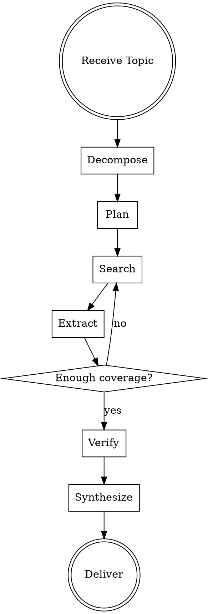

# Ultraresearch & Deep Research

## Overview

A systematic, multi-stage process for conducting thorough, well-sourced research using any available tools. Core principle: **never settle for the first answer** — plan, decompose, search iteratively, verify, and synthesize.

## When to Use

- User asks for "research", "deep dive", "comprehensive overview", "state of the art"
- Need to compare multiple approaches, tools, or frameworks
- Need to verify claims or find authoritative sources
- Topic is broad, ambiguous, or requires multi-hop reasoning

**When NOT to use:** Simple factual questions answerable in 1-2 sentences; questions where you already have high-confidence internal knowledge and no source verification is needed.

## The Research Loop



## Core Stages

### 1. DECOMPOSE (Self-Ask)

Before searching, break the user's question into **2-6 sub-questions** that collectively answer the whole.

**Rules:**
- Each sub-question should be independently searchable
- Include at least one "what are the current best practices?" or "what changed recently?"
- If the topic has conflicting viewpoints, include a sub-question about trade-offs

**Example:**
- User: "Should I use Qdrant or Pinecone?"
- Sub-questions: (1) What are Qdrant's strengths/limitations? (2) What are Pinecone's strengths/limitations? (3) What do recent benchmarks say? (4) What are the cost/latency trade-offs? (5) Which use cases favor each?

### 2. PLAN

Create a **search plan** before executing. The plan should include:

| Element | Purpose |
|---------|---------|
| Target sources | arXiv, GitHub, official docs, blogs, comparison sites |
| Search queries | 2-4 queries per sub-question, phrased differently |
| Verification strategy | How you'll cross-check key claims |
| Deliverable format | Structured report, comparison table, step-by-step guide |

**Rule:** For complex topics, **present the plan to the user** and ask for feedback before executing. This prevents wasted effort on wrong assumptions.

### 3. SEARCH (Iterative & Multi-hop)

Execute searches using all available tools (web search, webfetch, APIs).

**Rules:**
- Start broad, then narrow based on findings
- Each search result should inform the next query
- **Minimum 3 distinct sources** per major claim
- If a source is behind a paywall or fails, find an alternative — don't skip

**Anti-pattern:** Running one search query and using only the top result.

### 4. EXTRACT

For each source, extract:
- Key claims (1-2 sentences each)
- Evidence or data supporting the claim
- Limitations or caveats mentioned
- Source quality signal (official doc, peer-reviewed, blog opinion, etc.)

**Rule:** If a source is longer than 2000 words, use chunking — extract only relevant sections.

### 5. VERIFY (Chain-of-Verification)

For each major claim, explicitly check:

```
Claim: "X is faster than Y by 30%"
Verification:
  1. Who measured this? (benchmark author credibility)
  2. Under what conditions? (hardware, dataset, version)
  3. Is this confirmed by another independent source?
  4. Is the metric still relevant/current?
```

**Rules:**
- Flag claims with only one source as "[single source]"
- Flag claims where sources conflict as "[conflicting sources: A says X, B says Y]"
- Never suppress conflicting evidence — present it

### 6. SYNTHESIZE

Structure the output based on the user's original question:

**For comparisons:** Table with criteria as rows, options as columns
**For state-of-the-art:** Timeline or categorized list with "what changed recently"
**For how-to:** Step-by-step with prerequisites and gotchas
**For "should I use X":** Pros/cons with decision framework

**Rule:** Always include a "Sources" section with URLs or citations. For web sources, include access date.

## Quality Checklist

Before delivering, verify:

- [ ] Did I answer the user's original question directly?
- [ ] Are all major claims supported by at least 2 independent sources?
- [ ] Did I present conflicting evidence if it exists?
- [ ] Did I cite sources with enough detail to find them again?
- [ ] Did I distinguish between facts, benchmarks, and opinions?
- [ ] Is the information current (check dates on sources)?

## Common Mistakes

| Mistake | Fix |
|---------|-----|
| One-and-done search | Minimum 3 rounds of iterative search |
| Uncited claims | Every non-obvious claim needs a source |
| Ignoring recency | Check publication dates; prefer 2024+ for fast-moving fields |
| Cherry-picking | Present evidence that contradicts your initial hypothesis |
| Confusing correlation with causation | Be precise about what the source actually proves |
| Wall of text | Use tables, bullet lists, and bold for scannability |

## Red Flags — STOP and Re-search

- Only one source supports a major claim
- All sources are from the same author/organization
- No sources newer than 2 years for a fast-moving topic
- You're about to present a benchmark without checking methodology
- You found a perfect answer on the first search (too good to be true)
